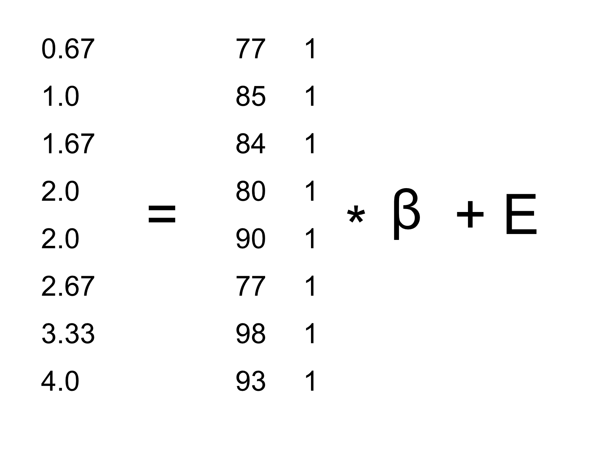

---
output:
  pdf_document: default
  html_document: default
---
# The General Linear Model

```{r echo=FALSE,warning=FALSE,message=FALSE}
library(tidyverse)
library(ggplot2)
library(fivethirtyeight)
library(BayesMed)
library(caret)
library(MASS)
library(cowplot)

library(pander)
panderOptions('round',2)
panderOptions('digits',7)

set.seed(123456) # set random seed to exactly replicate results

# load the NHANES data library
library(NHANES)

# drop duplicated IDs within the NHANES dataset
NHANES <- 
  NHANES %>% 
  dplyr::distinct(ID,.keep_all=TRUE)

NHANES_adult <- 
  NHANES %>%
  drop_na(Weight) %>%
  subset(Age>=18)


```

Remember that early in the book we described the basic model of statistics:

$$
outcome = model + error
$$
where our general goal is to find the model that minimizes the error, subject to some other constraints (such as keeping the model relatively simple so that we can generalize beyond our specific dataset). In this chapter we will focus on a particular implementation of this approach, which is known as the *general linear model* (or GLM).   You have already seen the general linear model in the earlier chapter on Fitting Models to Data, where we modeled height in the NHANES dataset as a function of age; here we will provide a more general introduction to the concept of the GLM and its many uses.

Before we discuss the general linear model, let's first define two terms that will be important for our discussion:

- *dependent variable*: This is the outcome variable that our model aims to explain (usually referred to as *Y*)
- *independent variable*: This is a variable that we wish to use in order to explain the dependent variable (usually referred to as *X*).  

There may be multiple independent variables, but for this course there will only be one dependent variable in our analyses.

A general linear model is one in which the model for the dependent variable is composed of a *linear combination* of independent variables that are each multiplied by a weight (which is often referred to as the Greek letter beta - $\beta$), which determines the relative contribution of that independent variable to the model prediction.

As an example, let's generate some simulated data for the relationship between study time and exam grades (see Figure \@ref(fig:StudytimeGrades)).

```{r}
# create simulated data for example
set.seed(12345)

# the number of points that having a prior class increases grades
betas <- c(6,5)  

df <- 
  data.frame(
    studyTime=c(2,3,5,6,6,8,10,12)/3,
    priorClass=c(0,1,1,0,1,0,1,0)
  ) %>%
  mutate(grade=studyTime*betas[1]+priorClass*betas[2] +round(rnorm(8,mean=70,sd=5))) 

lmResult <- lm(grade~studyTime,data=df)


```

```{r StudytimeGrades, echo=FALSE,fig.cap='Relation between study time and grades',fig.width=4,fig.height=4,out.height='50%'}
p <- ggplot(df,aes(studyTime,grade)) +
  geom_point(size=3) +
  xlab('Study time (hours)') +
  ylab('Grade (percent)') +
  xlim(0,5) + 
  ylim(70,100)

print(p)
```


Given these data, we might want to engage in each of the three fundamental activities of statistics:

- *Describe*: How strong is the relationship between grade and study time?
- *Decide*: Is there a statistically significant relationship between grade and study time?
- *Predict*: Given a particular amount of study time, what grade do we expect?

In the last chapter we learned how to describe the relationship between two variables using the correlation coefficient, so we can use that to describe the relationship here, and to test whether the correlation is statistically significant:

```{r}
# compute correlation between grades and study time
corTestResult <- cor.test(df$grade,df$studyTime,alternative='greater')
corTestResult

```

The correlation is quite high, but just barely reaches statistical significance because the sample size is so small.  

## Linear regression

We can also use the general linear model to describe the relation between two variables and to decide whether that relationship is statistically significant; in addition, the model allows us to predict the value of the dependent variable given some new value of the independent variables.  Most importantly, the general linear model will allow us to build models that incorporate multiple independent variables, whereas correlation can only tell us about the relationship between two individual variables.

The specific version of the GLM that we use for this is referred to as as *linear regression*.  The term *regression* was coined by Francis Galton, who had noted that when he compared parents and their children on some feature (such as height), the children of extreme parents (i.e. the very tall or very short parents) generally fell closer to the mean than their parents.  This is an extremely important point that we return to below.

The simplest version of the linear regression model (with a single independent variable) can be expressed as follows:

$$
y = x * \beta_x + \beta_0 + \epsilon
$$
The $\beta_x$ value tells us how much we would expect y to change given a one-unit change in x.  The intercept $\beta_0$ is an overall offset, which tells us what value we would expect y to have when $x=0$; you may remember from our early modeling discussion that this is important to model the overall magnitude of the data, even if $x$ never actually attains a value of zero. The error term $\epsilon$ refers to whatever is left over once the model has been fit. If we want to know how to predict y (which we call $\hat{y}$), then we can drop the error term:

$$
\hat{y} = x * \beta_x + \beta_0 
$$
Figure  \@ref(fig:LinearRegression) shows an example of this model applied to the study time example.

```{r LinearRegression,echo=FALSE,fig.cap="The linear regression solution for the study time data is shown in blue. The value of the intercept is equivalent to the predicted value of the y variable when the x variable is equal to zero; this is shown with a dotted black line.  The value of beta is equal to the slope of the line -- that is, how much it changes in y for a unit change in x.  This is shown schematically in the red dashed lines, which show the degree of increase in grade for a single unit increase in study time.",fig.width=6,fig.height=6,out.height='50%'}

p2 <- p+geom_abline(slope=lmResult$coefficients[2],
                  intercept=lmResult$coefficients[1],
                  color='blue')

lmResult <- lm(grade~studyTime,data=df)

p3 <- p2 +
  geom_hline(yintercept=lmResult$coefficients[1],color='black',size=0.5,linetype='dotted') +
  annotate('segment',x=2,xend=3,color='red',linetype='dashed',
           y=predict(lmResult,newdata=data.frame(studyTime=2))[1],
           yend=predict(lmResult,newdata=data.frame(studyTime=2))[1]) +
   annotate('segment',x=3,xend=3,color='red',linetype='dashed',
           y=predict(lmResult,newdata=data.frame(studyTime=2))[1],
           yend=predict(lmResult,newdata=data.frame(studyTime=3))[1])
 
print(p3)

```

### Regression to the mean

The concept of *regression to the mean* was one of Galton's essential contributions to science, and it remains a critical point to understand when we interpret the results of experimental data analyses.  Let's say that we want to study the effects of a reading intervention on the performance of poor readers.  To test our hypothesis, we might go into a school and recruit those individuals in the bottom 25% of the distribution on some reading test, administer the intervention, and then examine their performance.  Let's say that the intervention actually has no effect, and that reading scores for each individual are simply samples from a normal distribution.  We can simulate this:

```{r}
# create simulated data for regression to the mean example

nstudents <- 100
readingScores  <-  data.frame(
  test1=rnorm(nstudents)*10 + 100,
  test2=rnorm(nstudents)*10 + 100
)

# select the students in the bottom 25% on the first test
cutoff <- quantile(readingScores$test1,0.25)
readingScores <- 
  readingScores %>%
  mutate(badTest1=test1<cutoff)

readingScores %>%
  subset(badTest1==TRUE) %>%
  summarize(
    test1mean=mean(test1),
    test2mean=mean(test2)
  ) %>%
  pander()
```

If we look at the difference between the mean test performance at the first and second test, it appears that the intervention has helped these students substantially, as their scores have gone up by more than ten points on the test!  However, we know that in fact the students didn't improve at all, since in both cases the scores were simply selected from a random normal distribution. What has happened is that some subjects scored badly on the first test simply due to random chance. If we select just those subjects on the basis of their first test scores, they are guaranteed to move back towards the mean of the entire group on the second test, even if there is no effect of training. This is the reason that we need an untreated *control group* in order to interpret any changes in reading over time; otherwise we are likely to be tricked by regression to the mean.

### Estimating linear regression parameters

We generally estimate the parameters of a linear model from data using *linear algebra*, which is the form of algebra that is applied to vectors and matrices.  If you aren't familiar with linear algebra, don't worry -- you won't actually need to use it here, as R will do all the work for us.  However, a brief excursion in linear algebra can provide some insight into how the model parameters are estimated in practice.

First, let's introduce the idea of vectors and matrices; you've already encountered them in the context of R, but we will review them here.  A matrix is a set of numbers that are arranged in a squared or rectangle, such that there are one or more *dimensions* across which the matrix varies.  Let's take our study time data from above.  We could arrange these numbers in a matrix, which would have eight rows (one for each child) and two columns (one for study time, and one for grade).  If you are thinking "that sounds like a data frame in R" you are exactly right!  In fact, a data frame is a specialized version of a matrix, and we can convert them to a matrix using the `as.matrix()` function.

```{r}
df_matrix <- df %>% 
  dplyr::select(studyTime,grade) %>%
  as.matrix()
```

We can write the general linear model in linear algebra as follows:

$$
Y = X*\beta + E
$$
This looks very much like the earlier equation that we used, except that the letters are all capitalized, which is meant to express the fact that they are vectors.  

We know that the grade data go into the Y matrix, but what goes into the $X$ matrix?  Remember from our initial discussion of linear regression that we need to add a constant in addition to our independent variable of interest, so our $X$ matrix (which we call the *design matrix*) needs to include two columns:  one representing the study time variable, and one column with the same value for each individual (which we generally fill with all ones). We can view the resulting design matrix graphically (see Figure \@ref(fig:GLMmatrix)).

```{r GLMmatrix, echo=FALSE,fig.width=4, fig.height=4,fig.cap="A depiction of the study time data in terms of matrix algebra.",out.height='50%'}

```

The rules of matrix multiplication tell us that the dimensions of the matrices have to match with one another; in this case, the design matrix has dimensions of 8 (rows) X 2 (columns) and the Y variable has dimensions of 8 X 1, so the $\beta$ matrix needs to have dimensions 2 X 1, since an 8 X 2 matrix multiplied by a 2 X 1 matrix results in an 8 X 1 matrix (as the matching middle dimensions drop out).  The interpretation of the two values in the $\beta$ matrix is that they are the values to be multipled by study time and 1 respectively to obtain the estimated grade for each individual. We can also view these as individual equations for each individual:

$\hat{y}_1 = studyTime_1*\beta_1 + 1*\beta_2$

$\hat{y}_2 = studyTime_2*\beta_1 + 1*\beta_2$

...

$\hat{y}_8 = studyTime_8*\beta_1 + 1*\beta_2$

Remember that our goal is to determine the best fitting values of $\beta$ given the known values of $X$ and $Y$.  A naive way to do this would be to solve for $\beta$ using simple algebra -- here we drop the error term $E$ because it's out of our control:

$$
\hat{\beta} = \frac{Y}{X}
$$

The challenge here is that $X$ and $\beta$ are now matrices, not single numbers -- but the rules of linear algebra tell us how to divide by a matrix, which is the same as multiplying by the *inverse* of the matrix (referred to as $X^{-1}$).  We can do this in R:

```{r}
# compute beta estimates using linear algebra

Y <- as.matrix(df$grade)
X <- matrix(0,nrow=dim(Y)[1],ncol=2)
X[,1] <- as.matrix(df$studyTime)
X[,2] <- 1

# compute inverse of X using ginv()
# %*% is the R matrix multiplication operator

beta_hat <-  ginv(X) %*% Y
print(beta_hat)
```

Anyone who is interested in serious use of statistical methods is highly encouraged to invest some time in learning linear algebra, as it provides the basis for nearly all of the tools that are used in standard statistics.

### The relation between correlation and regression

There is a close relationship between correlation coefficients and regression coefficients.  Remember that Pearson's correlation coefficient is computed as the ratio of the covariance and the product of the standard deviations of x and y:

$$
\hat{r} = \frac{covariance_{xy}}{s_x * s_y}
$$
whereas the regression beta is computed as:

$$
\hat{\beta} = \frac{covariance_{xy}}{s_x*s_x}
$$

Based on these two equations, we can derive the relationship between $\hat{r}$ and $\hat{beta}$:

$$
covariance_{xy} = \hat{r} * s_x * s_y
$$

$$
\hat{\beta_x} =  \frac{\hat{r} * s_x * s_y}{s_x * s_x} = r * \frac{s_y}{s_x}
$$
That is, the regression slope is equal to the correlation value multiplied by the ratio of standard deviations of y and x.  One thing this tells us is that when the standard deviations of x and y are the same (e.g. when the data have been converted to Z scores), then the correlation estimate is equal to the regression slope estimate.

### Standard errors for regression models

If we want to make inferences about the regression parameter estimates, then we also need an estimate of their variability.  To compute this, we first need to compute the *residual variance* or *error variance* for the model -- that is, how much variability is not explained by the model.  We can compute the model residuals as follows:

$$
residual = y - \hat{y} = y - (x*\hat{\beta_x} + \hat{\beta_0})
$$
We then compute the *sum of squared errors (SSE)*:

$$
SS_{error} = \sum_{i=1}^n{(y_i - \hat{y_i})^2} = \sum_{i=1}^n{residuals^2}
$$
and from this we compute the *mean squared error*:

$$
MS_{error} = \frac{SS_{error}}{df} = \frac{\sum_{i=1}^n{(y_i - \hat{y_i})^2} }{N - p}
$$
where the degrees of freedom ($df$) are determined by subtracting the number of estimated parameters (2 in this case: $\hat{\beta_x}$ and $\hat{\beta_0}$) from the number of observations ($N$).  Once we have the mean squared error, we can compute the standard error for the model as:

$$
SE_{model} = \sqrt{MS_{error}}
$$

In order to get the standard error for a specific regression parameter estimate, we need to rescale $SE_{model}$ into the units of the particular parameter, by dividing it by the standard deviation of the X variable:

$$
SE_{\beta_x} = \frac{SE_{model}}{S_x}
$$

### Statistical tests for regression parameters

Once we have the parameter estimates and their standard errors, we can compute a *t* statistic to tell us the likelihood of the observed parameter estimates compared to some expected value under the null hypothesis. In this case we will test against the null hypothesis of no effect (i.e. $\beta=0$):

$$
\begin{array}{c}
t_{N - p} = \frac{\hat{\beta} - \beta_{expected}}{SE_{\hat{\beta}}}\\
t_{N - p} = \frac{\hat{\beta} - 0}{SE_{\hat{\beta}}}\\
t_{N - p} = \frac{\hat{\beta} }{SE_{\hat{\beta}}}
\end{array}
$$

In R, we don't need to compute these by hand, as they are automatically returned to us by the ```lm()``` function:

```{r}
summary(lmResult)
```

In this case we see that the intercept is significantly different from zero (which is not very interesting) and that the effect of studyTime on grades is marginally significant.

### Quantifying goodness of fit of the model

Sometimes it's useful to quantify how well the model fits the data overall, and one way to do this is to ask how much of the variability in the data is accounted for by the model.  This is quantified using a value called $R^2$ (also known as the *coefficient of determination*).  If there is only one x variable, then this is easy to compute by simply squaring the correlation coefficient:

$$
R^2 = r^2
$$
In the case of our study time data, $R^2$ = `r I(cor(df$studyTime,df$grade)**2)`, which means that we have accounted for about 40% of the variance in the data.

More generally we can think of $R^2$ as a measure of the fraction of variance in the data that is accounted for by the model, which can be computed by breaking the variance into multiple components:

$$
SS_{total} = SS_{model} + SS_{error}
$$
where $SS_{total}$ is the variance of the data ($y$) and $SS_{model}$ and $SS_{error}$ are computed as shown earlier in this chapter.  Using this, we can then compute the coefficient of determination as:

$$
R^2 = \frac{SS_{model}}{SS_{total}} = 1 - \frac{SS_{error}}{SS_{total}}
$$

A small value of $R^2$ tells us that even if the model fit is statistically significant, it may only explain a small amount of information in the data.

## Fitting more complex models

Often we would like to understand the effects of multiple variables on some particular outcome, and how they relate to one another.  In the context of our study time example, let's say that we discovered that some of the students had previously taken a course on the topic.  If we plot their grades (see Figure  \@ref(fig:StudytimeGradesPrior)), we can see that those who had a prior course perform much better than those who had not, given the same amount of study time.

```{r StudytimeGradesPrior, echo=FALSE,fig.cap='The relationship between study time and grades, with color identifying whether each student had taken a previous course on the topic',fig.width=6,fig.height=4,out.height='50%'}

p <- ggplot(df,aes(studyTime,grade,color=as.factor(priorClass))) +
  geom_point(size=3) + xlim(0,5) + ylim(70,100)
print(p)

```

We would like to build a statistical model that takes this into account, which we can do by extending the model that we built above:

$$
\hat{y} = \hat{\beta_1}*studyTime + \hat{\beta_2}*priorClass + \hat{\beta_0}
$$
To model whether each individual has had a previous class or not, we use what we call *dummy coding* in which we create a new variable that has a value of one to represent having had a class before, and zero otherwise.  This means that for people who have had the class before, we will simply add the value of $\hat{\beta_2}$ to our predicted value for them -- that is, using dummy coding $\hat{\beta_2}$ simply reflects the difference in means between the two groups. Our estimate of $\hat{\beta_1}$ reflects the regression slope over all of the data points --  we are assuming that regression slope is the same regardless of whether someone has had a class before (see Figure  \@ref(fig:LinearRegressionByPriorClass)).

```{r}
# perform linear regression for study time and prior class

# must change priorClass to a factor variable
df$priorClass <- as.factor(df$priorClass)

lmResultTwoVars <- lm(grade ~ studyTime + priorClass,data=df)
summary(lmResultTwoVars)

```

```{r LinearRegressionByPriorClass,echo=FALSE, fig.cap='The relation between study time and grade including prior experience as an additional component in the model.  The blue line shows the slope relating grades to study time, and the black dotted line corresponds to the difference in means between the two groups.',fig.width=6,fig.height=4,out.height='50%'}


p <- ggplot(df,aes(studyTime,grade,color=priorClass)) +
  geom_point(size=3) + xlim(0,5) + ylim(70,100)


p <- p+
  geom_abline(slope=lmResultTwoVars$coefficients[2],
              intercept=lmResultTwoVars$coefficients[1],color='red')

p <- p+
  annotate('segment',x=2,xend=3,
           y=lmResultTwoVars$coefficients[1]+
             2*lmResultTwoVars$coefficients[2],
           yend=lmResultTwoVars$coefficients[1]+
             2*lmResultTwoVars$coefficients[2],
           color='blue') +
  annotate('segment',x=3,xend=3,
           y=lmResultTwoVars$coefficients[1]+
             2*lmResultTwoVars$coefficients[2],
           yend=lmResultTwoVars$coefficients[1]+
             3*lmResultTwoVars$coefficients[2],
           color='blue')


p <- p+
  geom_abline(slope=lmResultTwoVars$coefficients[2],
              intercept=lmResultTwoVars$coefficients[1]+
                lmResultTwoVars$coefficients[3],
              color='green') 

p <- p+
  annotate('segment',x=2,xend=2,
           y=lmResultTwoVars$coefficients[1]+
             2*lmResultTwoVars$coefficients[2],
           yend=lmResultTwoVars$coefficients[1]+
             lmResultTwoVars$coefficients[3] +
             2*lmResultTwoVars$coefficients[2],
           linetype='dotted',size=1) 
print(p)
```

## Interactions between variables

In the previous model, we assumed that the effect of study time was the same for both groups. However, in some cases we might imagine that the effect of one variable might differ depending on the value of another variable, which we refer to as an *interaction* between variables.


```{r CaffeineSpeaking, echo=FALSE,fig.cap='The relationship between caffeine and public speaking',fig.width=4,fig.height=4,out.height='50%'}
set.seed(1234567)

df <- 
  data.frame(
    group=c(rep(-1,10),
            rep(1,10)
          )
  ) %>%
  mutate(caffeine=runif(n())*100) %>%
  mutate(speaking=0.5*caffeine*-group + group*20 + rnorm(20)*10)

p <- ggplot(df,aes(caffeine,speaking)) +
  geom_point()
print(p)

```

Let's use a new example that asks the question: What is the effect of caffeine on public speaking?  First let's generate some data and plot them.
Looking at Figure \@ref(fig:CaffeineSpeaking), there doesn't seem to be a relationship, and we can confirm that by performing linear regression on the data:

```{r}
# perform linear regression with caffeine as independent variable
lmResultCaffeine <- lm(speaking~caffeine,data=df)
summary(lmResultCaffeine)

```

But now let's say that we find research suggesting that anxious and non-anxious people react differently to caffeine.  First let's plot the data separately for anxious and non-anxious people.

```{r CaffeineSpeakingAnxiety,echo=FALSE,fig.cap='The relationship between caffeine and public speaking, with anxiety represented by the color of the data points',fig.width=6,fig.height=4,out.height='50%'}
df <- 
  df %>% 
  mutate(anxiety=ifelse(group==1,'anxious','notAnxious'))
p <- ggplot(df,aes(caffeine,speaking,color=anxiety)) +
  geom_point()
print(p)
```

As we see from Figure \@ref(fig:CaffeineSpeakingAnxiety), it appears that the relationship between speaking and caffeine is different for the two groups, with caffeine improving performance for people without anxiety and degrading performance for those with anxiety.  We'd like to create a statistical model that addresses this question.  First let's see what happens if we just include anxiety in the model.

```{r}
# compute linear regression adding anxiety to model
lmResultCafAnx <- lm(speaking ~ caffeine + anxiety,data=df)
summary(lmResultCafAnx)
```

Here we see there are no significant effects of either caffeine or anxiety, which might seem a bit confusing.  The problem is that this model is trying to fit the same line relating speaking to caffeine for both groups. If we want to fit them using separate lines, we need to include an *interaction* in the model, which is equivalent to fitting different lines for each of the two groups; in R this is denoted by the $*$ symbol.

```{r}
# compute linear regression including caffine X anxiety interaction
lmResultInteraction <- lm(speaking ~ caffeine + anxiety + caffeine*anxiety,
                          data=df)
summary(lmResultInteraction)
```

From these results we see that there are significant effects of both caffeine and anxiety (which we call *main effects*) and an interaction between caffeine and anxiety.  Figure \@ref(fig:CaffeineAnxietyInteraction) shows the separate regression lines for each group.


```{r CaffeineAnxietyInteraction, echo=FALSE,fig.cap='The relationship between public speaking and caffeine, including an interaction with anxiety.  This results in two lines that separately model the slope for each group.',fig.width=4,fig.height=4,out.height='50%'}

df_anx <- 
  df %>%
  subset(anxiety=='anxious')

df_notanx <- 
  df %>%
  subset(anxiety=='notAnxious')

p <- ggplot(df_anx,aes(caffeine,speaking)) +
  geom_point(color='blue') +
  geom_line(data=data.frame(x=df$caffeine[df$anxiety=='anxious'],
                    y=lmResultInteraction$fitted.values[df$anxiety=='anxious']),
            aes(x,y),color='blue') +
  geom_point(data=df_notanx,aes(caffeine,speaking),color='red')+
  geom_line(data=data.frame(x=df$caffeine[df$anxiety=='notAnxious'],
                    y=lmResultInteraction$fitted.values[df$anxiety=='notAnxious']),
            aes(x,y),color='red')
print(p)
```


Sometimes we want to compare the relative fit of two different models, in order to determine which is a better model; we refer to this as *model comparison*.  For the models above, we can compare the goodness of fit of the model with and without the interaction, using the`anova()` command in R:

```{r}
anova(lmResultCafAnx,lmResultInteraction)
```

This tells us that there is good evidence to prefer the model with the interaction over the one without an interaction.  Model comparison is relatively simple in this case because the two models are *nested* -- one of the models is a simplified version of the other model.  Model comparison with non-nested models can get much more complicated.


### What does "predict" really mean?

When we talk about "prediction" in daily life, we are generally referring to the ability to estimate the value of some variable in advance of seeing the data.  However, the term is often used in the context of linear regression to refer to the fitting of a model to the data; the estimated values ($\hat{y}$) are sometimes referred to as "predictions" and the independent variables are referred to as "predictors".  This has an unfortunate connotation, as it implies that our model should also be able to predict the values of new data points in the future. In reality, the fit of a model to a dataset will nearly always be better than the fit of the model to a new dataset [@copa:1983].  

As an example, let's take a sample of 48 children from NHANES and fit a regression model for weight that includes several regressors (age, height, hours spent watching TV and using the computer, and household income).  

```{r}
# get children with good values of all variables
NHANES_child <- 
  NHANES %>%
  drop_na(Height,Weight,TVHrsDayChild,HHIncomeMid,CompHrsDayChild,Age) %>%
  subset(Age<18)

# create function to sample data and compute regression on in-sample and out-of-sample data

get_sample_predictions <- function(sample_size,shuffle=FALSE) {
  
  orig_sample <- 
    NHANES_child %>%
    sample_n(sample_size)
  
  if (shuffle){
    orig_sample$Weight <- sample(orig_sample$Weight)
  }
  heightRegressOrig <- lm(Weight ~ Height*TVHrsDayChild*CompHrsDayChild*HHIncomeMid*Age,
                          data=orig_sample)
  
  pred_orig <- predict(heightRegressOrig)
  
  new_sample <- 
    NHANES_child %>%
    sample_n(sample_size)
  
  pred_new <- predict(heightRegressOrig,new_sample)
  
  return(c(cor(pred_orig,orig_sample$Weight)**2,
           cor(pred_new,new_sample$Weight)**2,
           sqrt(mean((pred_orig - orig_sample$Weight)**2)),
          sqrt(mean((pred_new - new_sample$Weight)**2))))

}

sim_results <- replicate(100,get_sample_predictions(48))
sim_results <- t(sim_results) %>%
  data.frame()
mean_rsquared <- 
  sim_results%>%
  summarize(rmse_original_data = mean(X3),
            rmse_new_data = mean(X4))
pander(mean_rsquared)

```

Here we see that whereas the model fit on the original data showed a very good fit (only off by a few pounds per individual), the same model does a much worse job of predicting the weight values for new children sampled from the same population (off by more than 20 pounds per individual).  This happens because the model that we specified is quite complex, since it includes not just each of the individual variables, but also all possible combinations of them (which we refer to as *interactions* as we will see in a later chapter), resulting in a model with 32 parameters.  Since this is almost as many coefficients as there are data points, the model *overfits* the data, just like the complex polynomial curve in our initial example of overfitting.

Another way to see the effects of overfitting is to look at what happens if we randomly shuffle the values of the weight variable, such that it should be impossible in principle to predict weight from the other variables, since they should have no systematic relationship.


```{r}
print('using shuffled y variable to simulate null effect')
sim_results <- replicate(100,get_sample_predictions(48,shuffle=TRUE))
sim_results <- t(sim_results) %>%
  data.frame()
mean_rsquared <- 
  sim_results%>%
  summarize(rmse_original_data = mean(X3),
            rmse_new_data = mean(X4))
pander(mean_rsquared)

```

This shows us that even when there is no true relationship to be modeled (because shuffling obliterated the relationship), the complex model still shows a very low error in its predictions, because it fits the noise in the specific dataset.  However, when that model is applied to a new dataset, we see that the error is much larger, as it should be.

#### Cross-validation

One method that has been developed to help address the problem of overfitting is known as *cross-validation*.  This technique is commonly used within the field of machine learning, which is focused on building models that can generalize well to new data, even when we don't have a new dataset to test the model. The idea behind cross-validation is that we fit our model repeatedly, each time leaving out a subset of the data, and then test the ability of the model to predict the values in each held-out subset.  Let's see how that would work for our weight prediction example.  In this case we will perform 12-fold cross-validation, which means that we will break the data into 12 subsets, and then fit the model 12 times, in each case leaving out one of the subsets and then testing the model's ability to accurately predict the value of the dependent variable for those held-out data points.  The `caret` package in R provides us with the ability to easily run cross-validation across our dataset:

```{r}
# create a function to run cross-validation
# returns the r-squared for the out-of-sample prediction

compute_cv <- function(d,nfolds=12) {
  # based on https://quantdev.ssri.psu.edu/tutorials/cross-validation-tutorial
  train_ctrl <- trainControl(method = "cv", number = nfolds)
  model_caret <- train(Weight ~ Height*TVHrsDayChild*CompHrsDayChild*HHIncomeMid*Age,
                            data=d,        
                       trControl = train_ctrl,  # folds
                       method = "lm")   # specifying regression model
  
  r2_cv <- mean(model_caret$resample$Rsquared)
  rmse_cv <- mean(model_caret$resample$RMSE)
  return(c(r2_cv,rmse_cv))
}

```

Using this function we can run cross-validation on 100 samples from the NHANES dataset, and compute the RMSE for cross-validation, along with the RMSE for the original data and a new dataset, as we computed above.

```{r, echo=FALSE,warning=FALSE}
# create function to sample data and compute regression on in-sample and out-of-sample data

get_sample_predictions_cv <- function(sample_size,shuffle=FALSE) {
  orig_sample <- 
    NHANES_child %>%
    sample_n(sample_size)
  
  if (shuffle){
    orig_sample$Weight <- sample(orig_sample$Weight)
  }
  
  heightRegressOrig <- lm(Weight ~ Height*TVHrsDayChild*CompHrsDayChild*HHIncomeMid*Age,
                          data=orig_sample)
  
  pred_orig <- predict(heightRegressOrig)
  
  new_sample <- 
    NHANES_child %>%
    sample_n(sample_size)
  
  pred_new <- predict(heightRegressOrig,new_sample)
  # run crossvalidation on original sample
  cv_output=compute_cv(orig_sample)
  return(c(cor(pred_orig,orig_sample$Weight)**2,
           cor(pred_new,new_sample$Weight)**2,
         cv_output[1],
         sqrt(mean((pred_orig - orig_sample$Weight)**2)),
         sqrt(mean((pred_new - new_sample$Weight)**2)),
         cv_output[2]))
         
}


sim_results <- replicate(100,get_sample_predictions_cv(48))
sim_results <- t(sim_results) %>%
  data.frame()
mean_rsquared <- 
  sim_results%>%
  summarize(mse_original_data = mean(X4),
            mse_new_data = mean(X5),
            mse_crossvalidation = mean(X6))
pander(mean_rsquared)


```

Here we see that crossvalidation gives us an estimate of predictive accuracy that is much closer to what we see with a completely new dataset than it is to the inflated accuracy that we see with the original dataset -- in fact, it's even slighlty more pessimistic than the average for a new dataset, probably because only part of the data are being used to train each of the models.  We can also confirm that cross-validation accurately estimates the predictive accuracy when the dependent variable is randomly shuffled:

```{r echo=FALSE,warning=FALSE}
# run crossvalidation with shuffled y variable 

sim_results <- replicate(100,get_sample_predictions_cv(48, shuffle=TRUE))
sim_results <- t(sim_results) %>%
  data.frame()
mean_rsquared <- 
  sim_results%>%
  summarize(rmse_original_data = mean(X4),
            rmse_new_data = mean(X5),
            rmse_crossvalidation = mean(X6))
pander(mean_rsquared)

```

Here again we see that crossvalidation gives us an assessment of prediction accuracy that is is much closer to what we expect with new data, and again even somewhat more pessimistic.

Using cross-validation properly is tricky, and it is recommended that you consult with an expert before using it in practice.  However, this section has hopefully shown you three things:

- "Prediction" doesn't always mean what you think it means
- Complex models can overfit data very badly, such that one can see seemingly good prediction even when there is no true signal to predict
- You should view claims about prediction accuracy very skeptically unless they have been done using the appropriate methods.

## Suggested readings

- [The Elements of Statistical Learning: Data Mining, Inference, and Prediction (2nd Edition)](https://web.stanford.edu/~hastie/Papers/ESLII.pdf) - The bible of machine learning methods, available freely online.
